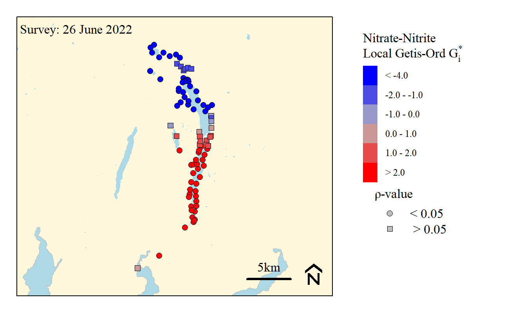
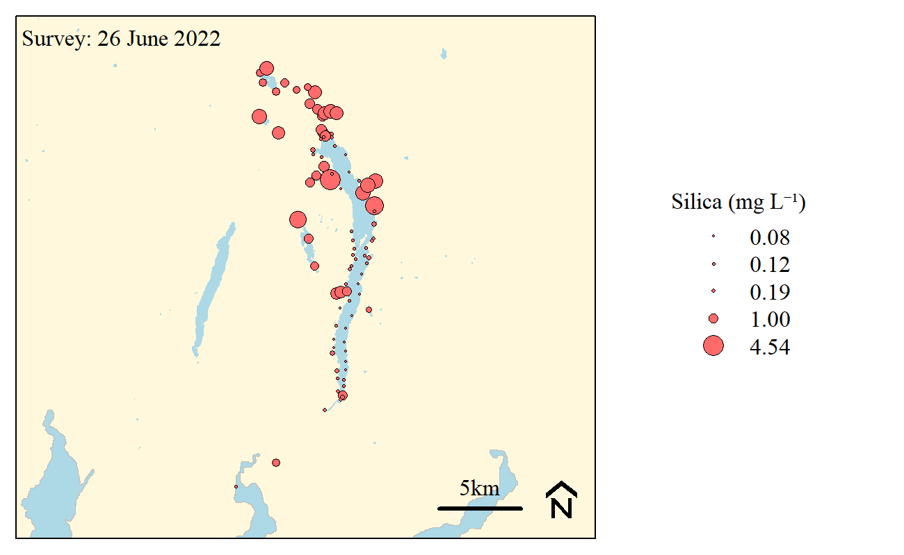

```{r xaringanExtra, include=FALSE, warnint=FALSE}
# devtools::install_github("gadenbuie/xaringanExtra")
# xaringanExtra::use_webcam()
xaringanExtra::use_tile_view()
# xaringanExtra::use_scribble()
# xaringanExtra::use_progress_bar("red", "bottom","0.25em")
```

```{r setup, include=FALSE}
library(knitr)

options(htmltools.dir.version = FALSE)
knitr::opts_chunk$set(warning = FALSE, message = FALSE, echo=FALSE)

##
library(flextable)
library(magrittr)
library(plyr)
library(reshape2)

wd="C:/Julian_LaCie/_Github/Windermere"

plot.path=paste0(wd,"/Plots/")
export.path=paste0(wd,"/Export/")

plot.figs=list.files(plot.path,full.names=T)

slides.figs=paste0(wd,"/slides/plots/")
file.copy(plot.figs,slides.figs,overwrite=T,recursive=T)


```

layout: true

---
name: title
class: left, middle

### The Big Windermere Survey 

June 2022 Geospatial Evaluation - DRAFT

`r paste(format(as.Date("2022-11-13"),"%B %d, %Y"))#,"<br>(Updated:", format(as.Date(Sys.Date()),"%B %d, %Y"),")")`


<!-- this ends up being the title slide since seal = FALSE-->


.footnote[
Paul Julian PhD [`r fontawesome::fa("fas fa-envelope")`](mailto: pauljulianphdn@gmail.com) .small[pauljulianphdn@gmail.com]

.small[Use cursor keys for navigation, press .red["O"] for a slide .red[O]verview]

]

---
name: objectives

## Objective(s)/Goal(s)

* Evaluate the Big Windermere Survey data using geostatistical techniques to understand variability in water quality spatially and temporally (relative to each survey sampling). 

## Methods

* Evaluate each synoptic survey sampling using the Getis-Ord hotspot statistic
  * This method provides information on local spatial structures and can identify areas of high (or low) clustering<sup>1,2</sup>.
  * Negative _G_ values indicate "cold spots" (values lower than expected relative to the "global" dataset)
  * Positive _G_ values indicate "hot spots" (values higher than expected)

.small[
* Initial Parameters:
  * [Total Phosphorus](#TP)
  * [Nitrate-Nitrite (total oxidizable Nitrogen)](#NOx)
  * Microbiological ([Total Coliforms](#TCol), [E. coli](#Ecol), [Enterococcus](#entro))
]
  
.footnote[
.small[
[1] Getis, Arthur, and J. K. Ord. 2010. “The Analysis of Spatial Association by Use of Distance Statistics.” Geographical Analysis 24 (3): 189–206. [link](https://doi.org/10.1111/j.1538-4632.1992.tb00261.x.)

[2] Hot Spot Analysis - Geospatial data analysis in #rstats [Link](https://swampthingecology.org/blog/hot-spot-analysis-geospatial-data-analysis-in-rstats.-part-3/)
]
]

---
name: TP

## Total Phosphorus 

```{r,out.width="85%",fig.align="center",fig.cap="Boxplot of total phosphorus concentrations across waterbodies." }


```

---
name: TP2

## Total Phosphorus 

```{r,out.width="85%",fig.align="center",fig.cap="Bubble map of total phosphorus concentrations across waterbodies." }


```

---
name: TP3

## Total Phosphorus 

```{r,out.width="85%",fig.align="center",fig.cap="Hotspot analysis of total phosphorus concentrations across waterbodies." }


```

---
name: NOx

## Nitrate-Nitrite (NOx)

```{r,out.width="85%",fig.align="center",fig.cap="Boxplot of nitrate-nitrite concentrations across waterbodies." }


```

---
name: NOx2

## Nitrate-Nitrite (NOx)

```{r,out.width="85%",fig.align="center",fig.cap="Bubble map of nitrate-nitrite concentrations across waterbodies." }


```

---
name: NOx3

## Nitrate-Nitrite (NOx)

```{r,out.width="85%",fig.align="center",fig.cap="Hotspot analysis of nitrate-nitrite concentrations across waterbodies." }


```

---
name: TCol

## Total Coliforms

```{r,out.width="85%",fig.align="center",fig.cap="Boxplot of total coliforms concentrations across waterbodies. (Note: y-axis in log scale)" }


```

---
name: TCol2

## Total Coliforms

```{r,out.width="85%",fig.align="center",fig.cap="Bubble map of total coliforms concentrations across waterbodies." }


```

---
name: TCol3

## Total Coliforms

```{r,out.width="85%",fig.align="center",fig.cap="Hotspot analysis of total coliforms concentrations across waterbodies." }


```

---
name: Ecol

## E. Coli

```{r,out.width="85%",fig.align="center",fig.cap="Boxplot of E. coli concentrations across waterbodies.(Note: y-axis in log scale)" }


```

---
name: Ecol2

## E. Coli

```{r,out.width="85%",fig.align="center",fig.cap="Bubble map of E. coli concentrations across waterbodies." }


```

---
name: Ecol3

## E. Coli

```{r,out.width="85%",fig.align="center",fig.cap="Hotspot analysis of E. coli concentrations across waterbodies." }


```

---
name: entro

## Enterococcus

```{r,out.width="85%",fig.align="center",fig.cap="Boxplot of Enterococcus concentrations across waterbodies.(Note: y-axis in log scale)" }


```

---
name: entro2

## Enterococcus

```{r,out.width="85%",fig.align="center",fig.cap="Bubble map of Enterococcus concentrations across waterbodies." }


```

---
name: entro3

## Enterococcus

```{r,out.width="85%",fig.align="center",fig.cap="Hotspot analysis of Enterococcus concentrations across waterbodies. (Note: y-axis in log scale)" }


```


---
name: con

## Preliminary Conclusions

* TP significantly lower (i.e. cold spot) throughout the majority of Lake Windermere, hotspot located at Leven monitoring location.

* NOx hotspot throughout Lake Windermere, coldspots north of Windermere.

* _(No Hotspot analysis)_ Dissolved silica concentrations are relative low in Windermere - [bubble plot](#extra1)
  * Potential link to algae growth dynamics.
  
* Total Coliforms spatial distribution is variable throughout the survey with some hotspots detected amongst coldspots in Windermere.

* E. coli less extreme with smaller hot and cold spots across the survey.

* Enterococcus is lower in Windermere than other area. 

* Next step - further evaluation of June survey and wait for next survey results. 
  * Evaluate nutrient stoichiometry (SRP:NOx, SRP:Si, NOx:Si) - relevant to algae dynamics   
  


---
name: extra1

## Dissolved Silica

```{r,out.width="85%",fig.align="center",fig.cap="Bubble map of dissolved silica concentrations across waterbodies" }


```